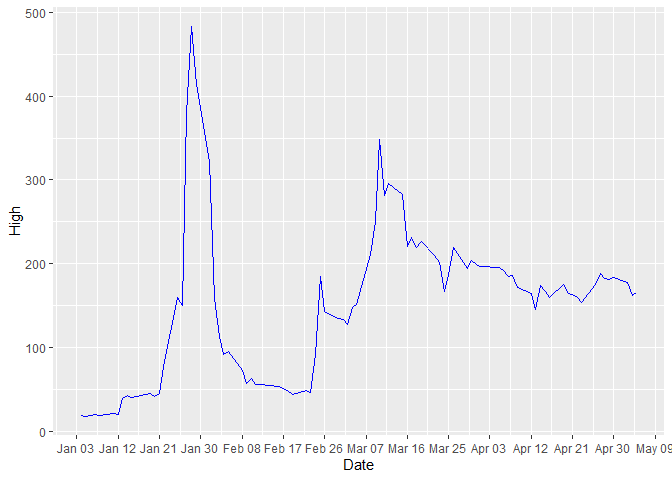
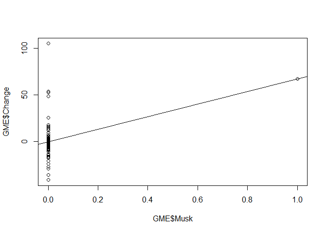

GME Regression Model
================

## Initial Setup

``` r
#Using Statlearning to draw regression model of how the users of subreddit WallStreetBets drove price of GME in 2021

#Initial Setup

library(dplyr) # for filter and join 
library(readr) # for read_csv
library(tidyverse) #for str_which
library(ggplot2) #for ggplot

#Loading WallStreetBets file
dataset1 <- read_csv("reddit_wsb.csv",col_types = cols(.default = "c"))
head(dataset1)
```

    ## # A tibble: 6 x 8
    ##   title        score id     url          comms_num created body        timestamp
    ##   <chr>        <chr> <chr>  <chr>        <chr>     <chr>   <chr>       <chr>    
    ## 1 "It's not a~ 55    l6ulcx https://v.r~ 6         161186~  <NA>       1/28/202~
    ## 2 "Math Profe~ 110   l6uibd https://v.r~ 23        161186~  <NA>       1/28/202~
    ## 3 "Exit the s~ 0     l6uhhn https://www~ 47        161186~ "The CEO o~ 1/28/202~
    ## 4 "NEW SEC FI~ 29    l6ugk6 https://sec~ 74        161186~  <NA>       1/28/202~
    ## 5 "Not to dis~ 71    l6ufgy https://i.r~ 156       161186~  <NA>       1/28/202~
    ## 6 "WE BREAKIN~ 405   l6uf7d https://i.r~ 84        161186~  <NA>       1/28/202~

``` r
#Loading GME Market data from Jan to April 2021
GME<-read.table(unz("archive.zip","GME.csv"), header=T,quote="\"",sep=",")
head(GME)
```

    ##         Date  Open  High   Low Close Adj.Close   Volume
    ## 1 2021-01-04 19.00 19.10 17.15 17.25     17.25 10022500
    ## 2 2021-01-05 17.35 18.08 17.23 17.37     17.37  4961500
    ## 3 2021-01-06 17.34 18.98 17.33 18.36     18.36  6056200
    ## 4 2021-01-07 18.47 19.45 18.02 18.08     18.08  6129300
    ## 5 2021-01-08 18.18 18.30 17.08 17.69     17.69  6482000
    ## 6 2021-01-11 19.41 20.65 19.01 19.94     19.94 14908000

WSB data for feature ‘title’ has punctuation in text including “,”, “;”,
“.”, “/”, "“, and also, notoriously, the csv delimiter”\|". Using gsub
for eliminating delimiters from the title. Thanks to \[MLane@Kaggle\]
for providing the Data Cleaning algorithm for WallStreetBets.

``` r
dataset1$title = gsub(pattern = "\\,",".",dataset1$title)
dataset1$body  = gsub(pattern = "\\,",".",dataset1$body)
wsb<-dataset1
```

# I. Linear Regression Fit – GME High Price Against Freq of daily posts that mention ‘GME’ or ‘GameStop’

``` r
#Formatting Dates on both GME and WSB file
GME$Date<-as.Date(GME$Date,"%Y-%m-%d")  
wsb$X<-as.Date(wsb$timestamp,"%m/%d/%Y")

#Filter for keywords 'GameStop' and 'GME' using index
m<-str_which(wsb$title,"GME")
m<-append(m,str_which(wsb$title,"GameStop"))
wsb_gamestop<-wsb[c(m),]

#Deriving the frequency table for GameStop/GME Mentions in subreddit against Date
freq<-data.frame(table(wsb_gamestop$X))
freq$Var1<-as.Date(freq$Var1,"%Y-%m-%d")
colnames(freq)<-c("Date","Freq")

#Performing Left Join with the GME Stock Index file via Date
GME<-dplyr::left_join(GME,freq,by="Date")

GME$Freq[is.na(GME$Freq)] <- 0

#Regression modeling of GME High Price against Freq of GME mentions on WallStreetBets 
reg<-lm(High~Freq,data=GME)
summary(reg)
```

    ## 
    ## Call:
    ## lm(formula = High ~ Freq, data = GME)
    ## 
    ## Residuals:
    ##     Min      1Q  Median      3Q     Max 
    ## -125.39  -89.67   15.95   47.95  315.18 
    ## 
    ## Coefficients:
    ##              Estimate Std. Error t value Pr(>|t|)    
    ## (Intercept) 143.47337    9.94733  14.423  < 2e-16 ***
    ## Freq          0.09700    0.02976   3.259  0.00162 ** 
    ## ---
    ## Signif. codes:  0 '***' 0.001 '**' 0.01 '*' 0.05 '.' 0.1 ' ' 1
    ## 
    ## Residual standard error: 89.03 on 83 degrees of freedom
    ## Multiple R-squared:  0.1135, Adjusted R-squared:  0.1028 
    ## F-statistic: 10.62 on 1 and 83 DF,  p-value: 0.001621

``` r
plot(GME$Freq, GME$High)

abline(lm(High~Freq,data=GME))
```

<!-- -->

The abline is the least squares line and is determined by the
coefficient estimates β0 \~ 143.5 (intercept) and β1\~ 0.097 (slope). F
statistic &gt;1 and R squared value 0.1135 measures order of variance
between Daily Volume of GME mentions on WallStreetBets and GME’S Daily
High Price. Null hypothesis can be rejected, since p is significant at
0.00162. So, we reject the null hypothesis and deem there to be a
meaningful relationship between predictor and dependent variable.

``` r
#Running Regression Diagnostics
par(mfrow=c(2,2))
plot(reg)
```

<!-- -->

# II. Running Regression Diagnostics

Residuals vs Fitted. Used to check the linear relationship assumptions.
A horizontal line, without distinct patterns is an indication for a
linear relationship, what is good.

Normal Q-Q. Used to examine whether the residuals are normally
distributed. It’s good if residuals points follow the straight dashed
line.

Scale-Location (or Spread-Location). Used to check the homogeneity of
variance of the residuals (homoscedasticity). Horizontal line with
equally spread points is a good indication of homoscedasticity.

Residuals vs Leverage. Used to identify influential cases, that is
extreme values that might influence the regression results when included
or excluded from the analysis.

Looking at the Residuals vs Leverage plot, we look for data points
outside of a dashed line, Cook’s distance. When the points are outside,
this means that they have high Cook’s distance scores. In such a case,
the values are influential and have a bearing on the regression results.
The regression results will be altered if we exclude those cases
i.e. \#17,\#18,\#19.

Looking at our outliers

``` r
GME[c(17,18,19),]
```

    ##          Date   Open   High    Low  Close Adj.Close   Volume Freq
    ## 17 2021-01-27 354.83 380.00 249.00 347.51    347.51 93396700    0
    ## 18 2021-01-28 265.00 483.00 112.25 193.60    193.60 58815800  251
    ## 19 2021-01-29 379.71 413.98 250.00 325.00    325.00 50566100 2911

``` r
  ggplot(GME, aes(Date,High)) + 
  geom_line(colour="blue") + scale_x_date(date_labels = "%b %d", breaks= "9 days")
```

<!-- -->

Since the outliers pertain to the critical price movement dates, we are
retaining them for the purpose of this analysis.

# III. Multiple Regression Fit– High Price Against Musk’s tweet that mentions GME/GameStop ‘Gamestonk!!’ and Freq of GME mention on Subreddit WallStreetBets

``` r
#Assessing Impact of Musk's solitary tweet on 26th Jan on GME Price Movement
GME$Musk<-0
GME$Musk[GME$Date=="2021-01-26"]<-1

summary(lm(High~Freq+Musk,data=GME))
```

    ## 
    ## Call:
    ## lm(formula = High ~ Freq + Musk, data = GME)
    ## 
    ## Residuals:
    ##     Min      1Q  Median      3Q     Max 
    ## -125.31  -89.59   16.03   48.03  315.25 
    ## 
    ## Coefficients:
    ##              Estimate Std. Error t value Pr(>|t|)    
    ## (Intercept) 143.39086   10.07053  14.239  < 2e-16 ***
    ## Freq          0.09706    0.02995   3.240  0.00173 ** 
    ## Musk          6.60914   90.13356   0.073  0.94173    
    ## ---
    ## Signif. codes:  0 '***' 0.001 '**' 0.01 '*' 0.05 '.' 0.1 ' ' 1
    ## 
    ## Residual standard error: 89.57 on 82 degrees of freedom
    ## Multiple R-squared:  0.1135, Adjusted R-squared:  0.09189 
    ## F-statistic:  5.25 on 2 and 82 DF,  p-value: 0.007155

There is no relationship to be inferred between GME’s Stock High Price
and Musk’s tweet. As observed, p=0.94173 is not significant and Residual
Standard Error is high at 89.57.

``` r
GME$Change<-((GME$Close-GME$Open)/GME$Open)*100
summary(lm(Change~Freq+Musk,data=GME))
```

    ## 
    ## Call:
    ## lm(formula = Change ~ Freq + Musk, data = GME)
    ## 
    ## Residuals:
    ##     Min      1Q  Median      3Q     Max 
    ## -38.945  -6.854  -1.112   2.987 105.106 
    ## 
    ## Coefficients:
    ##              Estimate Std. Error t value Pr(>|t|)    
    ## (Intercept)  0.323111   2.161132   0.150 0.881518    
    ## Freq        -0.008440   0.006428  -1.313 0.192862    
    ## Musk        66.772643  19.342636   3.452 0.000882 ***
    ## ---
    ## Signif. codes:  0 '***' 0.001 '**' 0.01 '*' 0.05 '.' 0.1 ' ' 1
    ## 
    ## Residual standard error: 19.22 on 82 degrees of freedom
    ## Multiple R-squared:  0.1449, Adjusted R-squared:  0.124 
    ## F-statistic: 6.948 on 2 and 82 DF,  p-value: 0.001632

``` r
plot(GME$Musk,GME$Change)
abline(lm(Change~Musk,data=GME))
```

<!-- -->

# IV. Multiple Regression Fit– Change in Price Against Musk’s tweet that mentions GME/GameStop ’Gamestonk’and Freq of GME mention on Subreddit WallStreetBets

``` r
GME$Musk<-0
GME$Musk[GME$Date=="2021-01-26"]<-1

summary(lm(High~Freq+Musk,data=GME))
```

    ## 
    ## Call:
    ## lm(formula = High ~ Freq + Musk, data = GME)
    ## 
    ## Residuals:
    ##     Min      1Q  Median      3Q     Max 
    ## -125.31  -89.59   16.03   48.03  315.25 
    ## 
    ## Coefficients:
    ##              Estimate Std. Error t value Pr(>|t|)    
    ## (Intercept) 143.39086   10.07053  14.239  < 2e-16 ***
    ## Freq          0.09706    0.02995   3.240  0.00173 ** 
    ## Musk          6.60914   90.13356   0.073  0.94173    
    ## ---
    ## Signif. codes:  0 '***' 0.001 '**' 0.01 '*' 0.05 '.' 0.1 ' ' 1
    ## 
    ## Residual standard error: 89.57 on 82 degrees of freedom
    ## Multiple R-squared:  0.1135, Adjusted R-squared:  0.09189 
    ## F-statistic:  5.25 on 2 and 82 DF,  p-value: 0.007155

``` r
GME$Change<-((GME$Close-GME$Open)/GME$Open)*100

summary(lm(Change~Freq+Musk,data=GME))
```

    ## 
    ## Call:
    ## lm(formula = Change ~ Freq + Musk, data = GME)
    ## 
    ## Residuals:
    ##     Min      1Q  Median      3Q     Max 
    ## -38.945  -6.854  -1.112   2.987 105.106 
    ## 
    ## Coefficients:
    ##              Estimate Std. Error t value Pr(>|t|)    
    ## (Intercept)  0.323111   2.161132   0.150 0.881518    
    ## Freq        -0.008440   0.006428  -1.313 0.192862    
    ## Musk        66.772643  19.342636   3.452 0.000882 ***
    ## ---
    ## Signif. codes:  0 '***' 0.001 '**' 0.01 '*' 0.05 '.' 0.1 ' ' 1
    ## 
    ## Residual standard error: 19.22 on 82 degrees of freedom
    ## Multiple R-squared:  0.1449, Adjusted R-squared:  0.124 
    ## F-statistic: 6.948 on 2 and 82 DF,  p-value: 0.001632

``` r
plot(GME$Musk,GME$Change)
abline(lm(Change~Musk,data=GME))
```

<!-- -->

While GME’s High Price is not responsive to Musk’s tweeting, the %
change in price is, with p-value at 0.000882 and also observable using
correlation function. % Change in Stock Price is positively correlated
with Musk’s tweeting with F-Statistic being 6.948 and &gt;1.

``` r
correlation_matrix<-cor(GME[,-1])
correlation_matrix
```

    ##                  Open         High         Low       Close   Adj.Close
    ## Open       1.00000000  0.957683501  0.94232418  0.95972746  0.95972746
    ## High       0.95768350  1.000000000  0.85564267  0.92747845  0.92747845
    ## Low        0.94232418  0.855642672  1.00000000  0.96458336  0.96458336
    ## Close      0.95972746  0.927478453  0.96458336  1.00000000  1.00000000
    ## Adj.Close  0.95972746  0.927478453  0.96458336  1.00000000  1.00000000
    ## Volume    -0.10554424  0.031328562 -0.24298382 -0.09619792 -0.09619792
    ## Freq       0.33239192  0.336829136  0.18798522  0.26051733  0.26051733
    ## Musk      -0.06224279 -0.001461854 -0.06048403  0.02369134  0.02369134
    ## Change    -0.26739381 -0.179575288 -0.14587728 -0.04265070 -0.04265070
    ##                Volume        Freq         Musk     Change
    ## Open      -0.10554424  0.33239192 -0.062242793 -0.2673938
    ## High       0.03132856  0.33682914 -0.001461854 -0.1795753
    ## Low       -0.24298382  0.18798522 -0.060484029 -0.1458773
    ## Close     -0.09619792  0.26051733  0.023691340 -0.0426507
    ## Adj.Close -0.09619792  0.26051733  0.023691340 -0.0426507
    ## Volume     1.00000000  0.09886669  0.377004216  0.3129711
    ## Freq       0.09886669  1.00000000 -0.026966685 -0.1436342
    ## Musk       0.37700422 -0.02696668  1.000000000  0.3562654
    ## Change     0.31297107 -0.14363420  0.356265412  1.0000000
