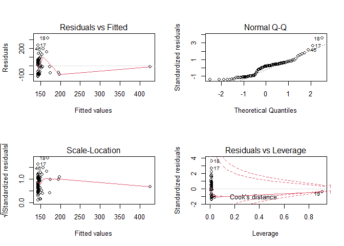

GME Regression Model
================

``` r
#Using Statlearning to draw regression model of how the users of subreddit WallStreetBets drove price of GME in 2021

#Initial Setup

library(dplyr) # for filter and join 
library(readr) # for read_csv
library(tidyverse) #for str_which

#Loading WallStreetBets file
dataset1 <- read_csv("reddit_wsb.csv",col_types = cols(.default = "c"))
head(dataset1)
```

    ## # A tibble: 6 x 8
    ##   title        score id     url          comms_num created body        timestamp
    ##   <chr>        <chr> <chr>  <chr>        <chr>     <chr>   <chr>       <chr>    
    ## 1 "It's not a~ 55    l6ulcx https://v.r~ 6         161186~  <NA>       1/28/202~
    ## 2 "Math Profe~ 110   l6uibd https://v.r~ 23        161186~  <NA>       1/28/202~
    ## 3 "Exit the s~ 0     l6uhhn https://www~ 47        161186~ "The CEO o~ 1/28/202~
    ## 4 "NEW SEC FI~ 29    l6ugk6 https://sec~ 74        161186~  <NA>       1/28/202~
    ## 5 "Not to dis~ 71    l6ufgy https://i.r~ 156       161186~  <NA>       1/28/202~
    ## 6 "WE BREAKIN~ 405   l6uf7d https://i.r~ 84        161186~  <NA>       1/28/202~

``` r
#Loading GME Market data from Jan to April 2021
GME<-read.table(unz("archive.zip","GME.csv"), header=T,quote="\"",sep=",")
head(GME)
```

    ##         Date  Open  High   Low Close Adj.Close   Volume
    ## 1 2021-01-04 19.00 19.10 17.15 17.25     17.25 10022500
    ## 2 2021-01-05 17.35 18.08 17.23 17.37     17.37  4961500
    ## 3 2021-01-06 17.34 18.98 17.33 18.36     18.36  6056200
    ## 4 2021-01-07 18.47 19.45 18.02 18.08     18.08  6129300
    ## 5 2021-01-08 18.18 18.30 17.08 17.69     17.69  6482000
    ## 6 2021-01-11 19.41 20.65 19.01 19.94     19.94 14908000

WSB data for feature ‘title’ has punctuation in text including “,”, “;”,
“.”, “/”, "“, and also, notoriously, the csv delimiter”\|" in title
text. We are using gsub for eliminating delimiters from the title.
Thanks to \[MLane@Kaggle\] for providing the Data Cleaning algorithm.

``` r
dataset1$title = gsub(pattern = "\\,",".",dataset1$title)
dataset1$body  = gsub(pattern = "\\,",".",dataset1$body)
wsb<-dataset1
```

Regression Fit Against frequency of daily posts that mention ‘GME’ or
‘GameStop’

``` r
#Formatting Dates on both GME and WSB file
GME$Date<-as.Date(GME$Date,"%Y-%m-%d")  
wsb$X<-as.Date(wsb$timestamp,"%m/%d/%Y")

#Filter for keywords 'GameStop' and 'GME' using index
m<-str_which(wsb$title,"GME")
m<-append(m,str_which(wsb$title,"GameStop"))
wsb_gamestop<-wsb[c(m),]

#Deriving the frequency table for GameStop/GME Mentions in subreddit against Date
freq<-data.frame(table(wsb_gamestop$X))
freq$Var1<-as.Date(freq$Var1,"%Y-%m-%d")
colnames(freq)<-c("Date","Freq")

#Performing Left Join with the GME Stock Index file via Date
GME<-dplyr::left_join(GME,freq,by="Date")

GME$Freq[is.na(GME$Freq)] <- 0

#Regression modeling of GME High Price against frequency of GME mentions on WallStreetBets 
reg<-lm(High~Freq,data=GME)
summary(reg)
```

    ## 
    ## Call:
    ## lm(formula = High ~ Freq, data = GME)
    ## 
    ## Residuals:
    ##     Min      1Q  Median      3Q     Max 
    ## -125.39  -89.67   15.95   47.95  315.18 
    ## 
    ## Coefficients:
    ##              Estimate Std. Error t value Pr(>|t|)    
    ## (Intercept) 143.47337    9.94733  14.423  < 2e-16 ***
    ## Freq          0.09700    0.02976   3.259  0.00162 ** 
    ## ---
    ## Signif. codes:  0 '***' 0.001 '**' 0.01 '*' 0.05 '.' 0.1 ' ' 1
    ## 
    ## Residual standard error: 89.03 on 83 degrees of freedom
    ## Multiple R-squared:  0.1135, Adjusted R-squared:  0.1028 
    ## F-statistic: 10.62 on 1 and 83 DF,  p-value: 0.001621

``` r
par(mfrow=c(2,2))
plot(reg)
```

<!-- -->

``` r
plot(GME$Freq, GME$High)

abline(lm(High~Freq,data=GME))
```

<!-- -->

The abline is the least squares line and is determined by the
coefficient estimates β0 \~ 143.5 (intercept) and β1\~ 0.097 (slope). F
statistic &gt;1 and R squared value 0.1135 measures order of variance
between Daily Volume of GME mentions on WallStreetBets and GME’S High
price. Null hypothesis can be rejected, since p is significant at
0.00162. So, we reject the null hypothesis and deem there to be some
causal relationship between predictor and dependent variable.

Looking at the Residuals vs Leverage plot, we look for a data point
outside of a dashed line, Cook’s distance. When the points are outside
of the Cook’s distance, this means that they have high Cook’s distance
scores. In this case, the values are influential to the regression
results. The regression results will be altered if we exclude those
cases i.e. \#17,\#18,\#19.

``` r
GME<-GME[-c(17,18,19,46),]
reg<-lm(High~Freq,data=GME)
summary(reg)
```

    ## 
    ## Call:
    ## lm(formula = High ~ Freq, data = GME)
    ## 
    ## Residuals:
    ##     Min      1Q  Median      3Q     Max 
    ## -118.50  -81.67   22.60   49.16  174.67 
    ## 
    ## Coefficients:
    ##              Estimate Std. Error t value Pr(>|t|)    
    ## (Intercept) 136.57666    9.23741  14.785   <2e-16 ***
    ## Freq          0.04780    0.08579   0.557    0.579    
    ## ---
    ## Signif. codes:  0 '***' 0.001 '**' 0.01 '*' 0.05 '.' 0.1 ' ' 1
    ## 
    ## Residual standard error: 76.07 on 79 degrees of freedom
    ## Multiple R-squared:  0.003914,   Adjusted R-squared:  -0.008694 
    ## F-statistic: 0.3105 on 1 and 79 DF,  p-value: 0.579

``` r
par(mfrow=c(2,2))
plot(reg)
```

<!-- -->

``` r
plot(GME$Freq, GME$High)

abline(lm(High~Freq,data=GME))
```

<!-- -->

Multiple Regression Fit Against Musk’s tweet that mentions GME/GameStop
‘Gamestonk’

``` r
#Assessing Impact of Musk's solitary tweet on 26th Jan on GME Price Movement
GME$Musk<-0
GME$Musk[GME$Date=="2021-01-26"]<-1

summary(lm(High~Freq+Musk,data=GME))
```

    ## 
    ## Call:
    ## lm(formula = High ~ Freq + Musk, data = GME)
    ## 
    ## Residuals:
    ##     Min      1Q  Median      3Q     Max 
    ## -118.30  -81.48   22.80   49.33  174.70 
    ## 
    ## Coefficients:
    ##              Estimate Std. Error t value Pr(>|t|)    
    ## (Intercept) 136.37575    9.36387  14.564   <2e-16 ***
    ## Freq          0.04856    0.08643   0.562    0.576    
    ## Musk         13.62425   77.10976   0.177    0.860    
    ## ---
    ## Signif. codes:  0 '***' 0.001 '**' 0.01 '*' 0.05 '.' 0.1 ' ' 1
    ## 
    ## Residual standard error: 76.54 on 78 degrees of freedom
    ## Multiple R-squared:  0.004313,   Adjusted R-squared:  -0.02122 
    ## F-statistic: 0.1689 on 2 and 78 DF,  p-value: 0.8449

There is no relationship to be inferred between GME’s High Price with
Musk’s tweet. As observed, p=0.94173 is not significant and Residual
Standard Error is high at 89.57.

``` r
GME$Change<-((GME$Close-GME$Open)/GME$Open)*100
summary(lm(Change~Freq+Musk,data=GME))
```

    ## 
    ## Call:
    ## lm(formula = Change ~ Freq + Musk, data = GME)
    ## 
    ## Residuals:
    ##     Min      1Q  Median      3Q     Max 
    ## -35.756  -7.752  -2.096   2.130 104.493 
    ## 
    ## Coefficients:
    ##             Estimate Std. Error t value Pr(>|t|)   
    ## (Intercept)  1.84631    2.35410   0.784  0.43524   
    ## Freq        -0.03780    0.02173  -1.740  0.08584 . 
    ## Musk        65.24944   19.38560   3.366  0.00119 **
    ## ---
    ## Signif. codes:  0 '***' 0.001 '**' 0.01 '*' 0.05 '.' 0.1 ' ' 1
    ## 
    ## Residual standard error: 19.24 on 78 degrees of freedom
    ## Multiple R-squared:  0.161,  Adjusted R-squared:  0.1395 
    ## F-statistic: 7.485 on 2 and 78 DF,  p-value: 0.001063

``` r
plot(GME$Musk,GME$Change)
abline(lm(Change~Musk,data=GME))
```

<!-- -->

Multiple Regression Fit Against Musk’s tweet that mentions GME/GameStop
‘Gamestonk’

``` r
GME$Musk<-0
GME$Musk[GME$Date=="2021-01-26"]<-1

summary(lm(High~Freq+Musk,data=GME))
```

    ## 
    ## Call:
    ## lm(formula = High ~ Freq + Musk, data = GME)
    ## 
    ## Residuals:
    ##     Min      1Q  Median      3Q     Max 
    ## -118.30  -81.48   22.80   49.33  174.70 
    ## 
    ## Coefficients:
    ##              Estimate Std. Error t value Pr(>|t|)    
    ## (Intercept) 136.37575    9.36387  14.564   <2e-16 ***
    ## Freq          0.04856    0.08643   0.562    0.576    
    ## Musk         13.62425   77.10976   0.177    0.860    
    ## ---
    ## Signif. codes:  0 '***' 0.001 '**' 0.01 '*' 0.05 '.' 0.1 ' ' 1
    ## 
    ## Residual standard error: 76.54 on 78 degrees of freedom
    ## Multiple R-squared:  0.004313,   Adjusted R-squared:  -0.02122 
    ## F-statistic: 0.1689 on 2 and 78 DF,  p-value: 0.8449

``` r
GME$Change<-((GME$Close-GME$Open)/GME$Open)*100

summary(lm(Change~Freq+Musk,data=GME))
```

    ## 
    ## Call:
    ## lm(formula = Change ~ Freq + Musk, data = GME)
    ## 
    ## Residuals:
    ##     Min      1Q  Median      3Q     Max 
    ## -35.756  -7.752  -2.096   2.130 104.493 
    ## 
    ## Coefficients:
    ##             Estimate Std. Error t value Pr(>|t|)   
    ## (Intercept)  1.84631    2.35410   0.784  0.43524   
    ## Freq        -0.03780    0.02173  -1.740  0.08584 . 
    ## Musk        65.24944   19.38560   3.366  0.00119 **
    ## ---
    ## Signif. codes:  0 '***' 0.001 '**' 0.01 '*' 0.05 '.' 0.1 ' ' 1
    ## 
    ## Residual standard error: 19.24 on 78 degrees of freedom
    ## Multiple R-squared:  0.161,  Adjusted R-squared:  0.1395 
    ## F-statistic: 7.485 on 2 and 78 DF,  p-value: 0.001063

``` r
plot(GME$Musk,GME$Change)
abline(lm(Change~Musk,data=GME))
```

<!-- -->

While GME’s High Price is not responsive to Musk’s tweeting, the %
change in price is, with p-value at 0.000882 and also observable using
correlation function. % Change in Stock Price is positively correlated
with Musk’s tweeting with F-Statistic being 6.948 and &gt;1.

``` r
correlation_matrix<-cor(GME[,-1])
correlation_matrix
```

    ##                  Open        High         Low         Close     Adj.Close
    ## Open       1.00000000  0.97825727  0.97143020  0.9535240778  0.9535240778
    ## High       0.97825727  1.00000000  0.95237584  0.9691222732  0.9691222732
    ## Low        0.97143020  0.95237584  1.00000000  0.9809407818  0.9809407818
    ## Close      0.95352408  0.96912227  0.98094078  1.0000000000  1.0000000000
    ## Adj.Close  0.95352408  0.96912227  0.98094078  1.0000000000  1.0000000000
    ## Volume    -0.23166180 -0.09483129 -0.31685403 -0.2110442003 -0.2110442003
    ## Freq       0.03722650  0.06256538 -0.05664501 -0.0437324818 -0.0437324818
    ## Musk      -0.05851967  0.01685357 -0.05720920  0.0390716205  0.0390716205
    ## Change    -0.24572858 -0.11590445 -0.13371367  0.0009285779  0.0009285779
    ##                Volume        Freq        Musk        Change
    ## Open      -0.23166180  0.03722650 -0.05851967 -0.2457285792
    ## High      -0.09483129  0.06256538  0.01685357 -0.1159044491
    ## Low       -0.31685403 -0.05664501 -0.05720920 -0.1337136731
    ## Close     -0.21104420 -0.04373248  0.03907162  0.0009285779
    ## Adj.Close -0.21104420 -0.04373248  0.03907162  0.0009285779
    ## Volume     1.00000000  0.18656425  0.38929576  0.3411482919
    ## Freq       0.18656425  1.00000000 -0.04930459 -0.1978896405
    ## Musk       0.38929576 -0.04930459  1.00000000  0.3584135641
    ## Change     0.34114829 -0.19788964  0.35841356  1.0000000000
